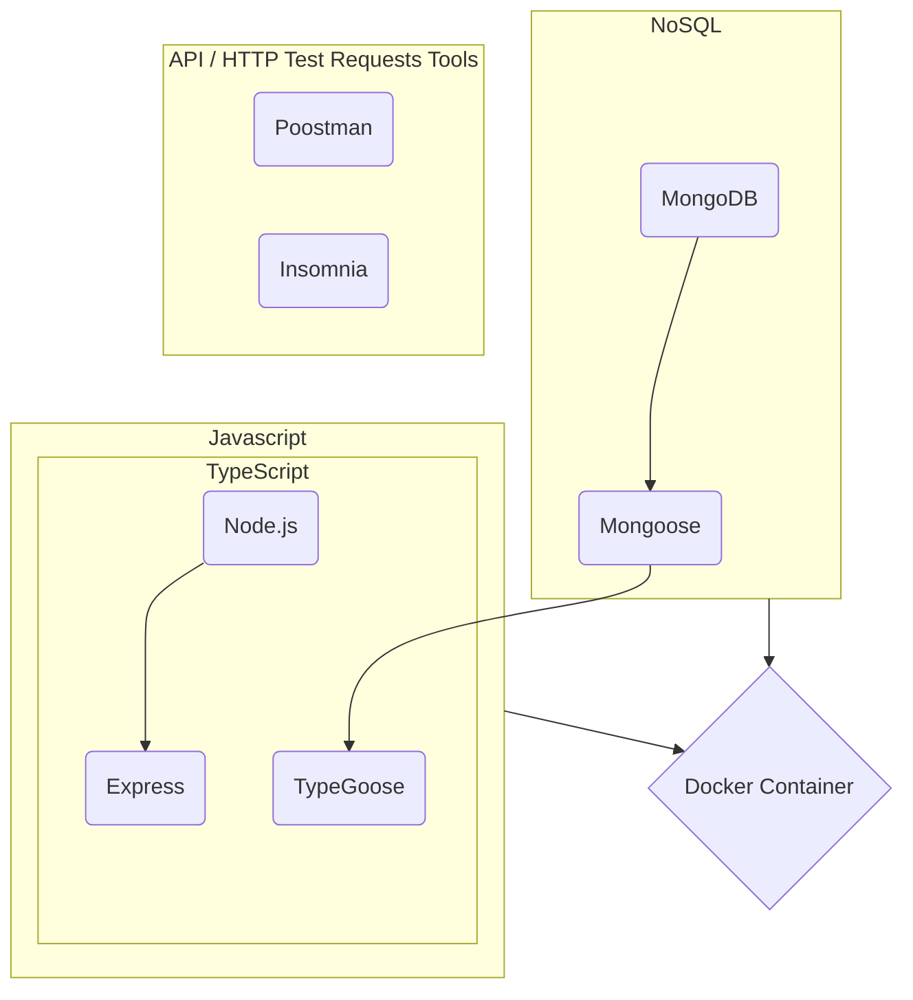

# Languages and Tools Used

        <a href="https://typegoose.github.io/typegoose/" target="_blank">   
<a href="https://postman.com" target="_blank"> 
     

# ATC Patient Management Backend
## [Docker](https://www.docker.com/)
* [Docker Documentation](https://docs.docker.com/get-started/overview/)
* [What is a Container?](https://www.docker.com/resources/what-container/)
* [Commandline References](https://docs.docker.com/engine/reference/commandline)
* Allows you to package and run an application in a loosely isolated environment called a container
* Can run multiple containers simultaneously on a host
* Containers contain everything needed to run the app, host won't have to install stuff
* Can share containers, allowing developers to work in standardized environments
* Docker client and daemon can run on the same system or connect to a remote Docker daemon
* **Daemon**
    *  listens for Docker API requests and manages Docker objects such as images, containers, networks, and volumes
* **Docker client**
    *  way that many Docker users interact with Docker (E.g, command "docker run")
* **Docker Desktop**
    * App that enables you to build and share containerized applications
    * Includes Docker daemon, Docker client, etc.
* **Docker Objects**
    * **Image** - read-only template with instructions for creating a Docker container
    * **Container** - is a runnable instance of an image
			
## [JavaScript](https://developer.mozilla.org/en-US/docs/Web/JavaScript)
* JIT compiled programming language that is used for writing scripts on webpages
* Generally ran client-side in the browser

    ## [Node.js](https://nodejs.org/en/about/)
    * a JavaScript runtime environment
    * typically executing the JavaScript runtime in a server side fashion
        * typically do not run node applications as the client
    * mostly used on the server-side
    * designed to build scalable network applications
    * NPM is a package manager for Node.js packages
        * installed with node.js

    ## [Express](https://expressjs.com/)
    * [Getting started](https://expressjs.com/en/starter/installing.html)
    * [Basic routing](https://expressjs.com/en/starter/basic-routing.html)
    * [Express routing](https://expressjs.com/en/guide/routing.html)
        * **Routing** - how an application’s endpoints (URIs) respond to client requests (GET, POST, PUT, DELETE)
    * [Express API Reference](https://expressjs.com/en/4x/api.html)
    * Node.js web application framework that provides a robust set of features for web and mobile applications
    * APIs
        * HTTP utility methods and middleware available for use
        * Allows quickly and easily creating a robust API

    ## [TypeScript](https://www.typescriptlang.org/)
    * [Handbook](https://www.typescriptlang.org/docs/handbook/typescript-from-scratch.html)
    * A strongly typed programming language that builds on JavaScript
    * TypeScript code converts to JavaScript, which runs anywhere JavaScript runs: In a browser, on Node.js and in your apps
    * **JavaScript with syntax for types**
        * TypeScript is a typed superset, meaning that it **adds rules about how different kinds of values can be used**
        * **static type checker** - checks a program for errors before execution, and does so based on the kinds of values
            * JavaScript’s equality operator (==) coerces its arguments, leading to unexpected behavior:

                
                * coerces objects or process of converting value from one type to another
            * JavaScript also allows accessing properties which aren’t present
                

                * obj.heigth was not a syntax error: it is an error of using some kind of value (a type) in an incorrect way
            * Most programming languages would throw an error when these sorts of errors occur, some would do so during compilation — before any code is running

            
            

  

## [NoSQL](https://www.mongodb.com/nosql-explained)
* non-relational database
    * is a paradigm, not a programming language
* **NoSQL databases** - store data in a format other than relational tables
    * Document databases 
        * JSON contains pairs of fields and values
    * Key-value databases 
    * Wide-column stores
    * Graph databases 
* **Schemaless** - does not have a schema in the same rigid way that relational databases have a schema
    * **Schema** - is a list of logical structures of data
	* logical grouping of objects such as tables, stored procedures, and functions
    * defines the structure of your collection documents / data
    * SQL vs NoSQL
        * Say a Relational Database has 2 tables - Users and Hobbies
		    *  Need a JOIN to retrieve all data about a user and their hobbies
            * NoSQL database - a single document can be retrieved from the database

        
        

    ## [MongoDB](https://www.mongodb.com/)
    * [What is MongoDB?](https://www.mongodb.com/what-is-mongodb)
    * [What is a Schemaless Database?](https://www.mongodb.com/unstructured-data/schemaless)
    * [MongoDB Examples](https://www.mongodb.com/basics/examples)
    * [Documentation](https://www.mongodb.com/docs/)
    * schema-less NoSQL document database
    * stores data in flexible, JSON-like documents
        * fields can vary from document to document and data structure can be changed over time
        * JSON-style documents which can have varying sets of fields with different data types for each field
        * Key-value pairs
    * **distributed database** - high availability, horizontal scaling

    ## [Mongoose](https://mongoosejs.com/)
    * [What is Mongoose?](https://www.mongodb.com/developer/languages/javascript/getting-started-with-mongodb-and-mongoose/)
    * [Intro to Mongoose](https://www.freecodecamp.org/news/introduction-to-mongoose-for-mongodb-d2a7aa593c57/)
    * [Getting Started](https://mongoosejs.com/docs/index.html)
    * [Schemas Guide](https://mongoosejs.com/docs/guide.html#schemas)
    * **provides a schema-based solution to model your application data**
    * includes built-in type casting, validation, query building, business logic hooks and more
    * Object Data Modeling (ODM) library for MongoDB and Node.js
        * manages relationships between data, provides schema validation
        * is used to translate between objects in code and the representation of those objects in MongoDB.
    * Mongoose forces a semi-rigid schema from the beginning. 
        * must define a Schema and Model
        * Unlike how MongoDB has a flexible data model by default
            *  schema defines the structure of your collection documents
                * define each field and its data type
            * Models take your schema and apply it to each document in its collection.

    ## [TypeGoose](https://typegoose.github.io/typegoose/)
    * Define Mongoose models using TypeScript classes
    * use mongoose schema's & model's in typescript

  

## [Postman](https://www.postman.com/) or [Insomnia](https://insomnia.rest/)
* Postman is an API platform for building and using APIs
    * create, share, test and document APIs
	* an create and save simple and complex HTTP/s requests, as well as read their responses.
* Insomnia is a Free Tool for Testing and Validating Results of RESTful applications
* This is how we are testing requests for the project

## [Git](https://git-scm.com/)
* is a distributed version control system to manage projects